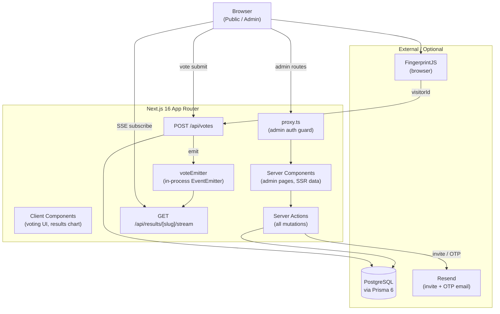
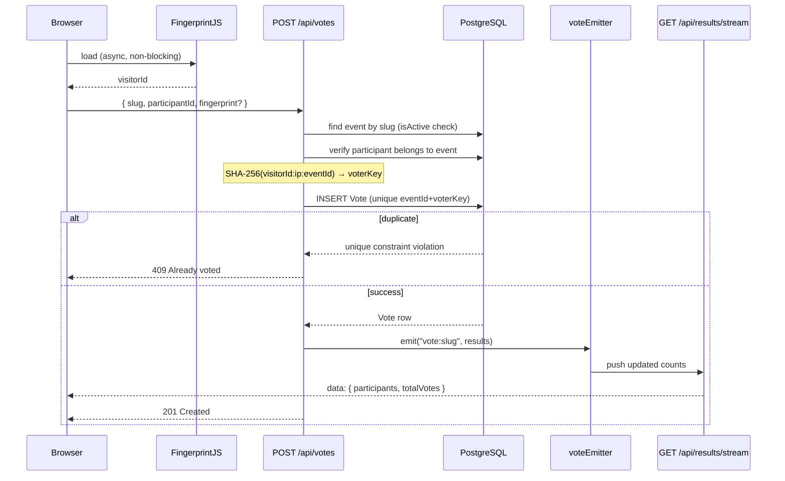
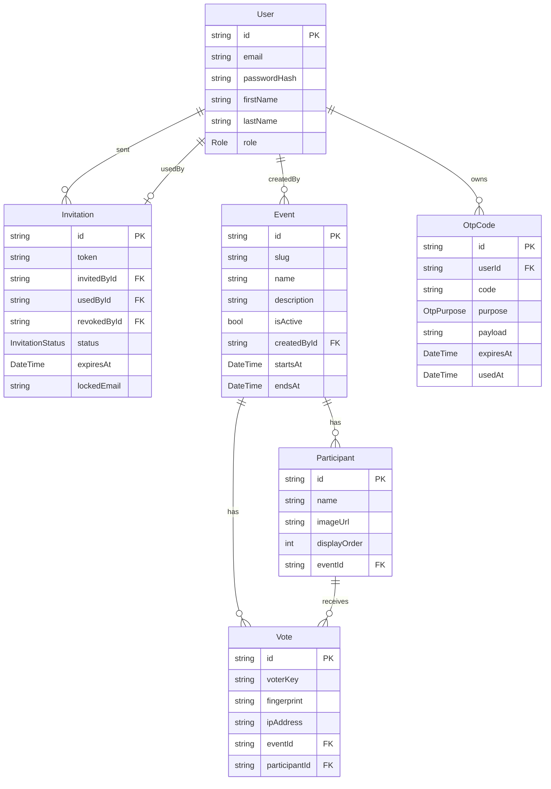

# Voting App

A full-stack live voting platform built with Next.js 16 (App Router), PostgreSQL, and Auth.js. Admins manage events and participants; the public votes via shareable links; results update in real time via Server-Sent Events — no polling, no WebSockets, no external realtime infrastructure.


---

## Table of Contents

1. [Features](#features)
2. [Architecture](#architecture)
3. [Database Schema](#database-schema)
4. [Key Engineering Decisions](#key-engineering-decisions)
5. [Security Design](#security-design)
6. [Real-time Results](#real-time-results)
7. [Project Structure](#project-structure)
8. [Local Development](#local-development)
9. [Environment Variables](#environment-variables)
10. [Scripts](#scripts)

---

## Features

- **Invite-only admin provisioning** — a super admin is bootstrapped from environment variables; all other admins are onboarded via single-use, expiring invite tokens (optionally emailed via Resend).
- **Event and participant management** — admins create voting events with unique public slugs, add participants with optional images and display ordering, and toggle events active/inactive.
- **Public voting** — no account required; voters reach the ballot at `/vote/[slug]`.
- **Duplicate-vote prevention** — browser fingerprint (FingerprintJS) and server-side IP are combined and hashed into a `voterKey`; the database enforces one vote per key per event.
- **Real-time results** — `/results/[slug]` streams live vote counts over Server-Sent Events with initial SSR data and a 30-second keepalive heartbeat.
- **QR code generation** — vote and results URLs are rendered as downloadable QR codes for physical display.
- **OTP-guarded profile changes** — email and password changes require a time-limited one-time code sent to the current email address.
- **Role-based access** — `SUPER_ADMIN` sees all events and manages users/invitations; `ADMIN` manages only their own events.
- **Light / dark theme** — via `next-themes` and CSS custom properties.
- **Optional email** — the app is fully functional without Resend configured; invite URLs are returned as copyable strings.

---

## Architecture

### System overview



### Route map

| URL | Access | Type |
|-----|--------|------|
| `/` | Public | Server Component |
| `/vote/[slug]` | Public | Server Component + Client voting UI |
| `/results/[slug]` | Public | SSR + Client SSE subscription |
| `/api/votes` | Public | Route Handler (POST) |
| `/api/results/[slug]/stream` | Public | Route Handler (GET, SSE) |
| `/admin/login` | Public (unauthenticated only) | Server Component |
| `/admin/register?token=…` | Public (valid token) | Server Component + form |
| `/admin` | Authenticated | Server Component |
| `/admin/events/*` | Authenticated | Server Component + Server Actions |
| `/admin/profile` | Authenticated | Server Component + Server Actions |
| `/admin/invitations` | Super Admin only | Server Component + Server Actions |
| `/admin/users` | Super Admin only | Server Component + Server Actions |

### Vote submission data flow



---

## Database Schema



### Models

**`User`** — admins only (no public accounts). `role` is `SUPER_ADMIN` or `ADMIN`. Password stored as bcrypt hash.

**`Invitation`** — tracks invite lifecycle (`PENDING` → `ACCEPTED` | `REVOKED` | `EXPIRED`). `token` is a 32-character `nanoid`. Optional `lockedEmail` restricts use to one address. Single-use: `usedById` has a unique constraint.

**`Event`** — `slug` is a 10-character `nanoid`, used in all public URLs. `isActive` is the primary gate for accepting votes. `startsAt`/`endsAt` are stored for display but do not automatically open/close voting.

**`Participant`** — belongs to one event (cascade delete). `displayOrder` controls ballot ordering.

**`Vote`** — `@@unique([eventId, voterKey])` enforces the one-vote-per-person-per-event constraint at the database level. `fingerprint` (raw visitor ID) is stored separately for audit purposes but is not part of the uniqueness key.

**`OtpCode`** — supports `CHANGE_EMAIL` and `CHANGE_PASSWORD` flows. For password changes, `payload` stores the pre-hashed bcrypt value so the plaintext password never persists. `usedAt` prevents replay after first use.

---

## Key Engineering Decisions

### 1. Next.js App Router with Server Actions as the mutation layer

Rather than building a separate REST API for admin operations, all mutations (create/update/delete event, manage participants, invite users, etc.) go through Next.js Server Actions. This co-locates data fetching and mutation logic, enables `revalidatePath` for cache invalidation after writes, and eliminates a class of client/server API contract drift. Route Handlers are reserved for the two cases that genuinely require them: the vote submission endpoint (called from a client component without a form) and the SSE stream.

### 2. Invite-only admin registration

Open registration would allow anyone to create an admin account. Instead, the only way to become an admin is:
- Be the super admin (bootstrapped via `npm run db:seed` from environment variables), or
- Receive a single-use invite link from the super admin.

Invite tokens are 32-character `nanoid` strings, have a configurable expiry (1–90 days), can be optionally locked to a specific email address, and are immediately invalidated on use or revocation.

### 3. JWT sessions instead of database sessions

Auth.js is configured with `strategy: "jwt"`. This means no session table in the database and no DB round-trip on every authenticated request. The trade-off is that sessions cannot be revoked server-side mid-flight; the mitigation is that sensitive operations (email/password change) trigger a sign-out and require fresh authentication.

### 4. `proxy.ts` instead of `middleware.ts` for admin route protection

Next.js 16 introduced a breaking change to the edge middleware API. Auth.js v5 provides a `proxy.ts` integration point that runs at the correct stage of the request pipeline on this version. Using classic `middleware.ts` would silently fail to protect routes. The `AGENTS.md` file in this repository documents this explicitly to prevent regressions.

### 5. In-process `EventEmitter` for real-time results

Live vote counts are delivered over Server-Sent Events. When a vote is recorded, the API handler emits on a `voteEmitter` (a Node.js `EventEmitter` on `globalThis` to survive hot-reload). SSE handlers subscribe to `vote:${slug}` channels and push updated results to connected browsers.

This requires zero external infrastructure (no Redis, no WebSocket server). The known trade-off: this only works correctly on a single Node.js instance. A horizontally-scaled deployment would require replacing `voteEmitter` with Redis Pub/Sub or a similar message broker.

### 6. Privacy-oriented voter identification

The `voterKey` — the field that enforces one-vote-per-person — is constructed as:

```
SHA-256( visitorId + ":" + ipAddress + ":" + eventId )
```

`visitorId` comes from FingerprintJS (or `"anonymous"` if unavailable). The raw fingerprint is stored in a separate nullable column for audit purposes but is not part of the uniqueness constraint. This means the unique key itself contains no personally identifiable information.

### 7. Public event slugs via `nanoid`

Events have an internal CUID primary key and a separate 10-character `nanoid` slug. Public URLs (`/vote/[slug]`, `/results/[slug]`) use the slug. This decouples public-facing links from internal IDs, keeps URLs short enough for QR codes, and avoids exposing the sequential or predictable structure of CUIDs.

### 8. Role-scoped multi-tenancy without an organisation table

The data model has no `Organisation` or `Tenant` entity. Instead, `eventWhereForUser()` in `lib/events/` returns a Prisma `where` clause that filters by `createdById` for `ADMIN` users and omits the filter entirely for `SUPER_ADMIN`. This keeps the schema simple and is appropriate for single-organisation deployments. Adding a tenant layer would be the natural next step for a multi-church SaaS version.

### 9. OTP-guarded sensitive profile changes

Changing a user's email or password is a high-risk operation. Both flows require the user to receive a 6-digit OTP at their current email address. The OTP has a 10-minute expiry and is marked `usedAt` on first use to prevent replay.

For password changes specifically, the new password is bcrypt-hashed client-side in the Server Action and stored in `OtpCode.payload` before the OTP is sent. When the OTP is confirmed, the hash is written to `User.passwordHash` directly — the plaintext password is never persisted anywhere beyond the initial server action call stack.

### 10. Graceful degradation when email is not configured

Resend is optional. Without `RESEND_API_KEY`:
- Invite creation still works; the invite URL is returned to the super admin as a copyable string.
- Profile OTP flows fail with an explicit error message rather than silently dropping the code.

This makes the application deployable without email infrastructure, useful for self-hosted or air-gapped environments.

---

## Security Design

| Concern | Mechanism |
|---------|-----------|
| Password storage | bcrypt, cost factor 12 |
| Session integrity | Auth.js JWT signed with `AUTH_SECRET` |
| Invite tokens | `nanoid(32)`, single-use, expiry-enforced, revocable by super admin |
| Duplicate votes | `@@unique([eventId, voterKey])` — DB-level enforcement |
| Voter privacy | `voterKey` is a SHA-256 hash, not raw PII |
| OTP replay | `usedAt` timestamp; codes expire after 10 minutes |
| User deletion guards | Super admin cannot be deleted; users cannot self-delete; users with owned events are blocked |
| Admin route protection | `proxy.ts` redirects unauthenticated requests to `/admin/login` |
| Page-level authorization | `requireUser()` / `requireSuperAdmin()` called at the top of all Server Actions; SUPER_ADMIN pages also redirect at the page level |

---

## Real-time Results

The results page at `/results/[slug]` delivers vote counts in real time without polling.

**Initial load (SSR):** the page is server-rendered with the current vote tallies from the database. Users see data immediately, before any JavaScript runs.

**Live updates (SSE):** the client component opens an `EventSource` connection to `/api/results/[slug]/stream`. The server holds the connection open, writing:
- A `data:` line with serialized `EventResults` JSON on every new vote.
- A `:` comment line every 30 seconds as a keepalive heartbeat (prevents proxies and load balancers from closing idle connections).

**Publication path:**
1. `POST /api/votes` inserts the vote row.
2. It calls `voteEmitter.emit("vote:slug", updatedResults)`.
3. Every active SSE handler subscribed to that channel writes the payload to its response stream.
4. On client disconnect, the handler calls `voteEmitter.off(...)` to clean up.

**Scaling note:** `voteEmitter` lives in the Node.js process. On a single-instance deployment (Vercel Hobby, Railway, single VPS) this works correctly. Multi-instance deployments (Vercel Pro with multiple function instances, ECS, etc.) would require a shared pub/sub layer (Redis, Upstash, etc.) to ensure all SSE clients receive every vote regardless of which instance handled the `POST`.

---

## Project Structure

```
.
├── app/                          # Next.js App Router
│   ├── layout.tsx                # Root layout: Inter font, ThemeProvider
│   ├── page.tsx                  # Public landing page
│   ├── globals.css               # CSS custom properties (theme tokens)
│   ├── vote/[slug]/              # Public ballot page
│   ├── results/[slug]/           # Public live results page
│   ├── admin/
│   │   ├── (public)/             # login, register — no admin shell
│   │   └── (protected)/          # dashboard, events, users, invitations, profile
│   └── api/
│       ├── auth/[...nextauth]/   # Auth.js route handler
│       ├── votes/                # POST — submit a vote
│       └── results/[slug]/stream # GET — SSE vote stream
│
├── components/
│   ├── admin/                    # Admin UI: shell, forms, tables, profile OTP
│   ├── voting/                   # VotingUI client component
│   ├── results/                  # ResultsDashboard, VoteBarChart (Recharts)
│   └── ui/                       # Primitive components: Card, Button, Badge
│
├── lib/
│   ├── auth.ts                   # NextAuth config (Credentials provider, JWT)
│   ├── auth/                     # requireUser(), requireSuperAdmin()
│   ├── actions/                  # Server Actions: events, users, invitations, profile, participants
│   ├── events/                   # Access control, public fetch, dashboard row helpers
│   ├── votes/                    # voterKey construction (SHA-256 + IP)
│   ├── voting/                   # Client-side FingerprintJS loader
│   ├── invitations/              # Token validation, expiry logic
│   ├── email/                    # Resend: invite emails, OTP emails
│   ├── results.ts                # Aggregate vote counts from DB
│   ├── voteEmitter.ts            # In-process EventEmitter for SSE pub/sub
│   ├── prisma.ts                 # Prisma client singleton (globalThis for hot-reload)
│   ├── slug.ts                   # nanoid slug generation
│   └── urls.ts                   # Base URL resolution (NEXT_PUBLIC_APP_URL / VERCEL_URL / localhost)
│
├── prisma/
│   ├── schema.prisma             # Database schema
│   ├── seed.ts                   # Super admin bootstrap
│   └── migrations/               # Prisma migration history
│
├── types/
│   └── next-auth.d.ts            # Session/JWT type extensions (id, role)
│
├── proxy.ts                      # Admin route auth guard (Next.js 16 integration point)
├── prisma.config.ts              # Prisma 6 config + seed command (tsx)
├── next.config.ts                # Next.js config
└── tailwind.config.ts            # Tailwind v4 config
```

---

## Local Development

### Prerequisites

- Node.js 20+
- PostgreSQL (local, [Neon](https://neon.tech), or [Supabase](https://supabase.com))

### Setup

**1. Install dependencies**

```bash
npm install
```

**2. Configure environment variables**

```bash
cp .env.example .env
```

Edit `.env`. At minimum, set `DATABASE_URL`, `AUTH_SECRET`, and the super admin credentials. See [Environment Variables](#environment-variables) for the full reference.

**3. Apply the database schema**

```bash
npm run db:migrate
```

This runs `prisma migrate dev` and creates all tables.

**4. Seed the super admin**

```bash
npm run db:seed
```

Creates (or upserts) the super admin user from `SUPER_ADMIN_EMAIL` and `SUPER_ADMIN_PASSWORD`. This is the only account that does not require an invite.

**5. Start the dev server**

```bash
npm run dev
```

Open [http://localhost:3000](http://localhost:3000). Sign in at [http://localhost:3000/admin/login](http://localhost:3000/admin/login) with the super admin credentials.

### Onboarding additional admins

1. Sign in as super admin.
2. Go to **Invitations** and create an invite link (optionally lock it to an email address, set an expiry).
3. If Resend is configured the link is emailed; otherwise copy it from the UI.
4. The recipient visits the link and registers. They are created with the `ADMIN` role.

---

## Environment Variables

| Variable | Required | Description |
|----------|----------|-------------|
| `DATABASE_URL` | Yes | PostgreSQL connection string (`postgresql://...`) |
| `AUTH_SECRET` | Yes | Secret used to sign Auth.js JWTs. Generate with `openssl rand -hex 32`. |
| `NEXT_PUBLIC_APP_URL` | Recommended | Public base URL (`https://yourdomain.com`). Used in vote/results/invite links. Falls back to `VERCEL_URL` then `http://localhost:3000`. |
| `SUPER_ADMIN_EMAIL` | For seed | Email address of the bootstrapped super admin |
| `SUPER_ADMIN_PASSWORD` | For seed | Password for the bootstrapped super admin |
| `SUPER_ADMIN_NAME` | Optional | Display name for the super admin (default: `"Super Admin"`) |
| `RESEND_API_KEY` | Optional | Resend API key. Required to send invite and OTP emails. |
| `EMAIL_FROM` | Optional | Sender address for Resend emails (e.g. `Voting App <no-reply@yourdomain.com>`) |
| `VERCEL_URL` | Auto | Set automatically by Vercel. Used as base URL fallback if `NEXT_PUBLIC_APP_URL` is not set. |

> Setting `NEXT_PUBLIC_APP_URL` to your production domain is important. Without it, invite links and QR codes generated by the admin will point to the wrong origin.

---

## Scripts

| Script | Command | Description |
|--------|---------|-------------|
| `npm run dev` | `next dev --turbo` | Start dev server with Turbopack |
| `npm run build` | `prisma generate && next build` | Generate Prisma client and build for production |
| `npm start` | `next start` | Run the production server |
| `npm run lint` | `eslint` | Run ESLint |
| `npm run db:migrate` | `prisma migrate dev` | Apply pending migrations (dev) |
| `npm run db:generate` | `prisma generate` | Regenerate the Prisma client after schema changes |
| `npm run db:seed` | `prisma db seed` | Bootstrap the super admin user |

`postinstall` runs `prisma generate` automatically after `npm install`.
